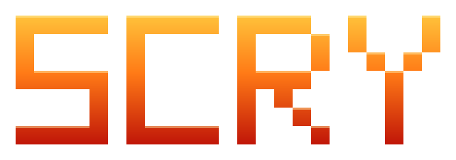

**Look at the metrics you already collect and see which machines are heading for a bad day.**

To scry is to gaze into a glass and read what is coming. This one reads a stream of metrics. It learns what each machine looks like when it is healthy, and when one starts sliding toward a pattern that tends to end in failure, it tells you early, while there is still time to act. Every resource lands in one of five plain buckets: healthy, about to need more room, heading for failure, already going downhill, or just plain strange. It can also sketch where a metric is likely to go over the next few minutes to hours.

## What this is (and is not)

A working exhibit, built in the open. It grew out of a system that ran against real production monitoring, and it is being rebuilt here as a general tool you can point at your own metrics. It is not a supported product: no stability guarantees, no roadmap promises. If you want a turnkey monitoring suite, this is not it. If you want to see how early failure prediction actually fits together, and run it on your own data, read on.

## Bring your own data

No trained models ship here, on purpose: the old ones learned from telemetry that is not mine to give away. You bring your own metrics as a simple table, one row per resource, metric, time, and value, from a local file or your object storage, and train your own. LogicMonitor works as a first-class source, and anything that can produce that table works just as well.

## License

Apache-2.0. Use it, fork it, learn from it.

WAKE UP TO FIND OUT THAT YOU ARE THE EYES OF THE WORLD
